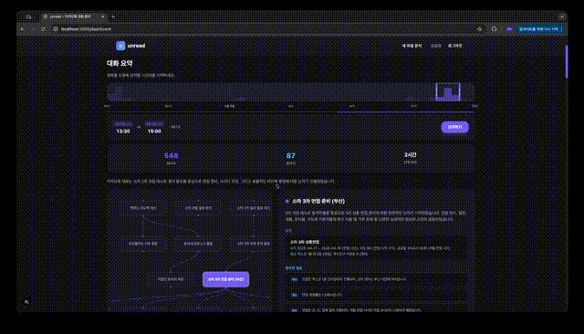
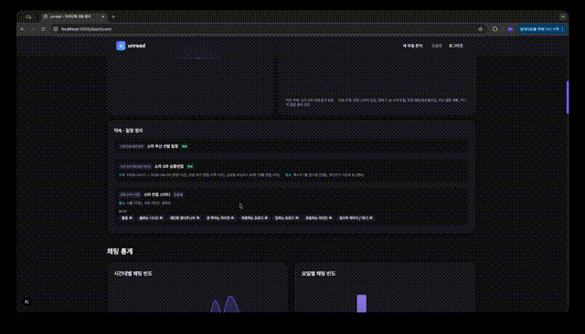
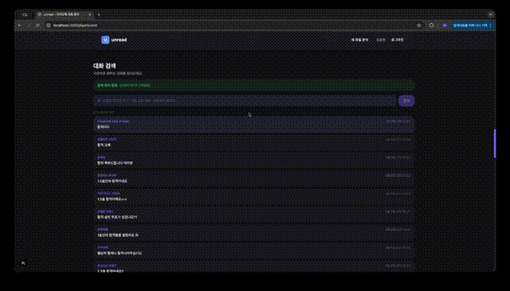

# 📖 unread - AI 기반 카카오톡 대화 분석 서비스

> 카카오톡 대화를 업로드하고 Google Gemini AI로 종합 분석하는 풀스택 서비스


## ✨ 주요 기능 시연

### 1️⃣ 파일 업로드 & 즉시 분석
모바일 카카오톡 대화(.zip) 또는 PC 대화(.csv)를 드래그&드롭으로 업로드하면 자동으로 파싱되고 AI 분석이 시작됩니다.


**지원 형식**:
- 📱 모바일: KakaoTalk_*.txt (ZIP 압축)
- 💻 PC: CSV 파일 (자동 컬럼 감지)

---

### 2️⃣ 기간별 대화 요약
특정 기간을 선택하면 해당 기간의 대화 내용을 AI가 자동으로 요약합니다.



**분석 내용**:
- 대화의 주요 흐름 및 맥락
- 핵심 주제 및 토픽
- 시간대별 메시지 빈도 분포

---

### 3️⃣ 일정 추출 & 참석자 분석
AI가 대화에서 자동으로 일정을 추출하고, 각 일정의 참석자별 근거 메시지를 클릭으로 확인할 수 있습니다.



**기능**:
- 🗓️ 자동 일정 추출 및 정리
- 👥 참석자별 근거 메시지 표시
- 💬 클릭으로 원문 메시지 확인

---

### 4️⃣ Vector 검색 (의미 기반 검색)
VectorDB를 활용한 의미 기반 검색으로 키워드가 정확하지 않아도 관련된 메시지를 찾을 수 있습니다.



**검색 방식**:
- 🔍 자연어 기반 의미 검색
- 📊 유사도 점수 표시
- ⚡ PgVector 기반 빠른 검색


---

## 🚀 빠른 시작

### 1. 환경 설정

```bash
# Backend 환경변수 설정
export GEMINI_API_KEY=$(api_key)
export SPRING_DATASOURCE_URL=jdbc:postgresql://localhost:5432/unread
export SPRING_DATASOURCE_USERNAME=postgres
export SPRING_DATASOURCE_PASSWORD=password

# Frontend 환경변수 (.env.local)
NEXT_PUBLIC_API_BASE_URL=http://localhost:8080/api
BACKEND_URL=http://localhost:8080
NEXT_PUBLIC_MOCK_SESSION_ID=1
```

### 2. 데이터베이스 초기화

```bash
# PostgreSQL 접속
psql -U postgres -d unread -f backend/src/main/resources/schema.sql
```

### 3. 백엔드 실행

```bash
cd backend
./gradlew bootRun
# http://localhost:8080 접속 가능
```

### 4. 프론트엔드 실행

```bash
cd frontend
npm install
npm run dev
# http://localhost:3000 접속
```


---


## 🎨 주요 기능 상세

### 자동 파싱
- **모바일**: KakaoTalk_*.txt 파일 자동 감지 및 정규식 파싱
- **PC**: CSV 자동 컬럼 감지 (날짜/시간/보낸사람/내용)

### AI 분석
- **LLM**: Google Gemini 2.0 Flash (한국어 최적화)
- **분석 항목**:
  - 📝 대화 요약 (주요 흐름)
  - 🏷️ 주제 추출 (3-5개 토픽)
  - 💬 키워드별 핵심 메시지
  - 📅 일정 추출 및 참석자 매핑

### 벡터 검색
- **PgVector 활용**: 의미 기반 유사도 검색
- **실시간 임베딩**: Gemini Embedding API로 질의 변환
- **성능**: 대규모 메시지도 밀리초 단위 검색

### 시각화
- **시간대별 분포**: 0~23시 메시지 수 (바 차트)
- **참여자 비율**: 메시지 수 기반 파이 차트
- **키워드 하이라이트**: 원문에서 키워드 색상 표시


**마지막 업데이트**: 2026-04-15

